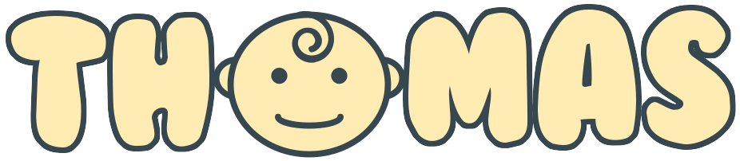

Welcome to the **Thomas Theme** for the **[WebHemi](https://github.com/Gixx/WebHemi) project**. I dedicate this to my son, Thomas. 

# License #
Source codes/files - souch as .twig, .js, .json, .css, .jpg, .png - which are not covered in the _Additional licenses_ section are licensed under the [MIT](LICENSE) license. 

## Additional licenses ##

* The theme uses Google's [Material Design Lite](https://getmdl.io) project for the layout design.
* The Admin Login page uses free wallpapers from the [7-Themes](http://7-themes.com) website.
* All SVG icons are the property of [Gabor Ivan](https://github.com/Gixx) as a customer of the icon creator [Round Icons](https://roundicons.com/usage-license/). Reuse of these images out of this theme is prohibited. 

# Change Log #
Check [Change log](CHANGELOG.md)
